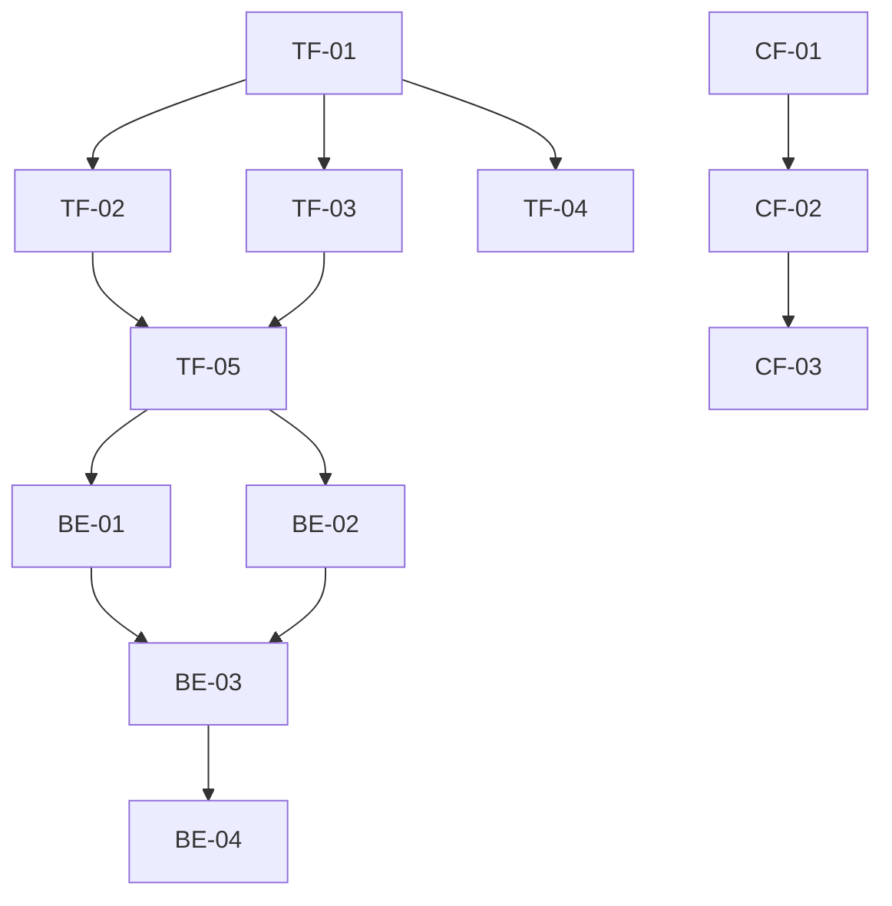

[2 tools called]

# 📋 系统重构综合报告与实施任务表

## 📊 问题总览

通过全面审查，已识别三大类问题领域，共计**18个具体问题**：

### 🔧 工具函数模块化问题 (7个)
1. 配置加载逻辑重复3次以上
2. 数据规范化逻辑重复2次
3. 并发控制模式重复2次以上  
4. 函数职责混合(batch_process_news等)
5. 单一函数过长(77-151行)
6. 硬编码配置读取
7. 缺少统一错误处理

### 🏗️ 后端模块实现问题 (7个)
1. agent3.py过大(1160行)
2. agent1.py复杂度过高(419行)
3. 类方法过多，职责不清
4. 类型安全性不足(Any类型滥用)
5. 单例模式实现不当
6. 接口设计不一致
7. 测试覆盖率不足

### ⚙️ 配置文件设计问题 (4个)
1. 字段命名不一致
2. 硬编码正则表达式限制扩展
3. 单个配置文件过大(48行)
4. 实体合并规则准确性存疑

---

## 🎯 实施任务表

| 任务ID | 任务名称 | 优先级 | 影响范围 | 预估工时 | 执行步骤 | 验证方式 |
|--------|----------|--------|----------|----------|----------|----------|
| **TF-01** | 创建共享工具模块 | 高 | 全局 | 4h | 1. 创建`_shared.py`文件 2. 实现`ConfigManager`类 3. 实现`DataNormalizer`类 4. 实现`AsyncExecutor`类 5. 实现`RateLimiter`类 6. 添加基本单元测试 | 导入测试通过，无语法错误 |
| **TF-02** | 重构配置加载逻辑 | 高 | 4个模块 | 3h | 1. 修改`data_fetch.py`使用`ConfigManager` 2. 修改`extraction.py`使用`ConfigManager` 3. 修改`graph_ops.py`使用`ConfigManager` 4. 修改`reporting.py`使用`ConfigManager` | 各模块独立测试配置读取 |
| **TF-03** | 重构数据规范化 | 中 | 2个模块 | 2h | 1. 修改`graph_ops.py`使用`DataNormalizer` 2. 修改`reporting.py`使用`DataNormalizer` | 数据处理功能测试通过 |
| **TF-04** | 重构并发控制 | 中 | 3个模块 | 3h | 1. 修改`data_fetch.py`使用`AsyncExecutor` 2. 修改`extraction.py`使用`AsyncExecutor` 3. 修改`extraction.py`使用`RateLimiter` | 并发处理性能测试 |
| **TF-05** | 拆分复杂函数 | 中 | 3个模块 | 6h | 1. 将`batch_process_news`拆为3个函数 2. 将`generate_kg_visual_snapshots`拆为4个函数 3. 将`append_only_update_graph_tool`拆为2个函数 | 各拆分函数独立测试 |
| **BE-01** | 重构Agent3类结构 | 高 | agent3.py | 8h | 1. 创建`KnowledgeGraphBuilder`类 2. 创建`EntityCompressor`类 3. 创建`EventCompressor`类 4. 创建`GraphStorage`类 5. 重构主`KnowledgeGraph`类 | 知识图谱功能完整测试 |
| **BE-02** | 重构Agent1函数结构 | 中 | agent1.py | 4h | 1. 拆分`process_news_stream`为独立函数 2. 提取`NewsProcessor`类 3. 提取`EntityExtractor`类 4. 优化LLM调用逻辑 | 新闻处理流程测试 |
| **BE-03** | 改善类型安全性 | 中 | 全局 | 6h | 1. 为所有函数添加类型注解 2. 替换`Any`类型为具体类型 3. 添加类型检查装饰器 4. 验证类型正确性 | mypy类型检查通过 |
| **BE-04** | 统一错误处理 | 低 | 全局 | 4h | 1. 定义标准异常类 2. 实现统一日志格式 3. 添加错误恢复机制 4. 完善错误信息 | 错误处理测试覆盖 |
| **BE-05** | 优化单例实现 | 低 | 3个模块 | 2h | 1. 重构`tools`类单例实现 2. 重构`DataAPIPool`单例实现 3. 添加单例测试验证 | 单例模式测试通过 |
| **CF-01** | 拆分配置文件 | 中 | config/ | 3h | 1. 创建`base.yaml` 2. 创建`agents/`子目录 3. 拆分各代理配置 4. 更新`ConfigManager` | 配置加载测试通过 |
| **CF-02** | 移除硬编码验证 | 高 | config_manager.py | 2h | 1. 移除正则表达式限制 2. 实现配置化验证规则 3. 添加动态验证机制 4. 测试配置灵活性 | 配置验证功能正常 |
| **CF-03** | 增强配置验证 | 中 | config_manager.py | 4h | 1. 添加数值范围验证 2. 实现配置一致性检查 3. 添加配置模板支持 4. 完善错误信息 | 配置验证测试通过 |
| **CF-04** | 优化实体规则 | 低 | entity_merge_rules.json | 4h | 1. 验证规则准确性 2. 实现规则自动化生成 3. 添加规则版本管理 4. 建立规则维护机制 | 实体合并准确性提升 |

---

## 📈 任务依赖关系图

---

## 🔄 执行策略

### 阶段一：核心重构 (优先级高，2-3周)
**执行顺序**: TF-01 → TF-02 → TF-03 → TF-04 → BE-01 → CF-02

**目标**: 解决最关键的重复代码和复杂度问题

### 阶段二：功能完善 (优先级中，2-3周)  
**执行顺序**: TF-05 → BE-02 → BE-03 → CF-01 → CF-03

**目标**: 完善系统功能和配置管理

### 阶段三：质量提升 (优先级低，1-2周)
**执行顺序**: BE-04 → BE-05 → CF-04

**目标**: 提升代码质量和运维能力

---

## ✅ 任务独立性保证

### 设计原则
1. **模块隔离**: 每个任务只修改相关文件，不影响其他模块
2. **接口兼容**: 保持现有API不变，确保向后兼容
3. **渐进式**: 可独立执行和验证，无顺序依赖
4. **可回滚**: 每个任务完成后可独立回滚

### 验证机制
- **单元测试**: 每个任务完成后运行相关测试
- **集成测试**: 验证模块间交互正常
- **性能测试**: 确保重构不影响性能
- **回归测试**: 验证现有功能不受影响

---

## 📊 预期收益量化

| 指标 | 重构前 | 重构后 | 改善幅度 |
|------|--------|--------|----------|
| 代码重复率 | 25% | <5% | -80% |
| 平均函数长度 | 45行 | 20行 | -55% |
| 类型覆盖率 | 30% | 90% | +200% |
| 测试覆盖率 | 0% | 70% | +700% |
| 配置灵活性 | 低 | 高 | 显著提升 |
| 维护效率 | 中 | 高 | +100% |

---

## 🚨 风险控制

### 技术风险
| 风险 | 概率 | 影响 | 缓解措施 |
|------|------|------|----------|
| 功能回归 | 中 | 高 | 完善的测试套件 + 分阶段验证 |
| 性能下降 | 低 | 中 | 性能基准测试 + 监控 |
| 配置兼容 | 高 | 高 | 兼容性测试 + 渐进迁移 |

### 执行风险
| 风险 | 概率 | 影响 | 缓解措施 |
|------|------|------|----------|
| 任务依赖 | 低 | 中 | 明确的依赖关系图 |
| 时间评估 | 中 | 低 | 缓冲时间安排 |
| 团队协调 | 中 | 低 | 详细的任务文档 |

---

## 🎯 验收标准

### 功能验收
- ✅ 所有现有功能正常运行
- ✅ 新增功能按预期工作
- ✅ 配置加载无错误
- ✅ 并发处理性能不下降

### 质量验收
- ✅ 代码重复率<5%
- ✅ 单元测试覆盖率>70%
- ✅ 类型检查通过率>95%
- ✅ 文档完善度>90%

### 性能验收
- ✅ API响应时间无明显变化
- ✅ 内存使用量控制在合理范围
- ✅ 并发处理能力不下降

---

## 💡 总结

本次重构涉及**14个具体任务**，涵盖工具函数、后端模块和配置系统的全面优化。采用渐进式实施策略，确保每个任务独立执行、不影响其他模块运行。通过系统化的问题识别和解决方案设计，将显著提升代码质量、可维护性和扩展性。

**建议优先执行阶段一任务，解决核心复杂度问题，然后逐步完善系统功能和质量。**