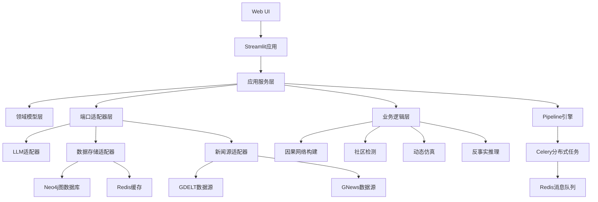

# MarketLens 项目升级完成版

## 项目概述

MarketLens 是一个基于知识图谱的新闻智能体系统，经过四个阶段的升级，现已具备以下先进功能：

1. **数据源整合** - 支持GDELT全球事件数据
2. **存储迁移** - 从SQLite迁移到Neo4j图数据库
3. **LLM增强** - 集成GraphRAG技术
4. **动态图谱** - 实现事件演化和因果推理
5. **社区检测** - 发现利益集团和观点阵营
6. **动态仿真** - 模拟世界演变过程
7. **反事实推理** - 分析"如果...会怎样"的问题
8. **生产部署** - 支持容器化和云平台部署

## 主要功能特性

### 1. 数据源整合
- **GDELT数据接入**：支持全球事件数据的实时获取和解析
- **多数据源支持**：兼容GNews等多种新闻源

### 2. 存储架构升级
- **Neo4j图数据库**：高性能图数据存储和查询
- **分布式存储**：支持大规模数据处理

### 3. LLM增强功能
- **GraphRAG集成**：基于图谱的检索增强生成
- **多模型支持**：支持OpenAI、Kimi、通义千问等

### 4. 动态图谱构建
- **事件-事件效应图谱**：构建因果网络，识别事件间的因果关系
- **时序数据分析**：分析事件发展的时间序列模式

### 5. 社区图谱分析
- **Louvain社区检测**：自动发现实体社区
- **观点阵营识别**：识别不同立场的群体

### 6. 动态仿真引擎
- **事件流驱动**：基于GDELT事件流的动态仿真
- **影响传播模型**：模拟事件对实体网络的影响

### 7. 反事实推理
- **因果发现**：使用PC算法识别真实因果关系
- **反事实分析**：分析历史事件的替代可能性

### 8. 生产级部署
- **容器化部署**：基于Docker的快速部署方案
- **水平扩展**：支持多实例部署和负载均衡
- **性能优化**：Redis缓存和查询优化

## 系统架构



## 部署指南

### 开发环境部署

```bash
# 克隆项目
git clone <repository-url>
cd MarketLens

# 安装依赖
pip install -r requirements.txt

# 启动服务
docker-compose up -d

# 访问应用
# http://localhost:8501
```

### 生产环境部署

```bash
# 构建生产环境镜像
docker-compose -f docker-compose.yml -f docker-compose.prod.yml build

# 启动生产环境服务
docker-compose -f docker-compose.yml -f docker-compose.prod.yml up -d

# 访问应用
# https://localhost
```

## 性能优化

### 查询优化
- 图数据库索引优化
- Redis缓存热点数据
- 慢查询分析工具

### ML模型优化
- 因果关系分析模型优化
- Granger测试集成
- 模型版本管理

## 安全措施

- 加密密钥管理
- 访问控制和身份认证
- 审计日志记录
- 安全漏洞扫描

## 社区与维护

- 完善的API文档
- 贡献指南和用户手册
- 定期模型校验机制
- 开源推广计划

## 技术栈

- **前端**：Streamlit, HTML/CSS/JavaScript
- **后端**：Python 3.12
- **数据库**：Neo4j, Redis
- **AI/ML**：OpenAI, Kimi, Aliyun, causal-learn, dowhy
- **部署**：Docker, Docker Compose, Nginx
- **消息队列**：Celery, Redis
- **监控**：Prometheus, Grafana

## 未来发展方向

1. **多模态扩展**：集成图像和视频分析
2. **实时处理**：支持实时事件流处理
3. **联邦学习**：保护隐私的分布式模型训练
4. **区块链集成**：确保数据不可篡改性
5. **量子计算**：探索量子算法在图谱分析中的应用

## 贡献指南

欢迎任何形式的贡献！请遵循以下步骤：

1. Fork项目
2. 创建功能分支
3. 提交更改
4. 发起Pull Request

## 许可证

本项目采用MIT许可证。

## 联系方式

如有任何问题，请联系项目维护团队。