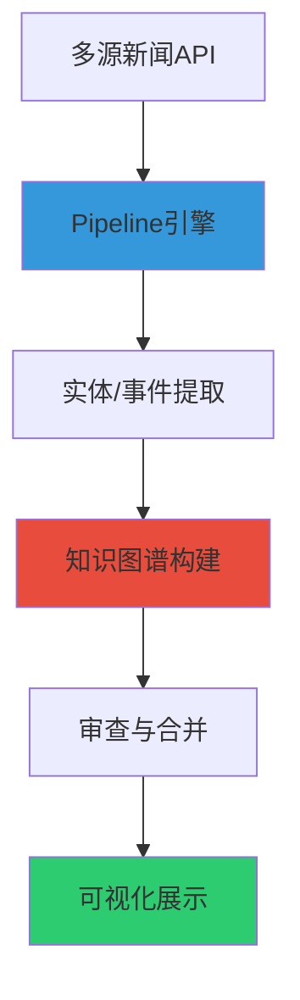

# MarketLens/README.md

## 智能新闻知识图谱系统

基于 LLM 和知识图谱技术的智能新闻处理与分析系统，通过 Pipeline 引擎和多智能体协作实现从**新闻抓取 → 实体/事件提取 → 知识图谱构建**的全自动化流程。

## 📋 项目概述

本项目构建了一个**智能新闻处理与知识图谱系统**，通过融合多源新闻数据，自动抽取实体、事件及其关联关系，动态构建可解释的知识图谱，并实现智能的去重、合并和知识推理，为用户提供结构化的新闻洞察和知识发现能力。

### 🏗️ 系统架构



### 🎯 核心特性

| 功能模块 | 状态 | 描述 |
|---------|------|------|
| 🌐 **多源新闻接入** | ✅ | 支持 GNews API 等多渠道新闻源（20+ 地区） |
| 🤖 **LLM 智能提取** | ✅ | 基于 LLM 的实体和事件自动抽取 |
| 🔍 **智能去重** | ✅ | SimHash 算法实现精确新闻去重 |
| 🧠 **实体合并决策** | ✅ | 基于 LLM 的智能实体合并（替代硬编码规则） |
| 🕸️ **知识图谱构建** | ✅ | 动态维护实体-事件关联网络 |
| 📊 **交互式可视化** | ✅ | PyVis 图谱可视化（平滑曲线、动态布局） |
| ⚡ **Pipeline 引擎** | ✅ | 可配置的工作流引擎（支持同步/异步） |
| 🔄 **异步并发处理** | ✅ | 基于 AsyncExecutor 的高效并发 |
| 🗄️ **SQLite 持久化** | ✅ | 结构化数据存储（实体/事件/审查任务） |
| 🔐 **配置管理** | ✅ | 多文件配置支持和加密密钥管理 |
| 🧪 **测试覆盖** | ✅ | 完整的单元测试覆盖率 |

## 🏛️ 架构设计

系统采用**领域驱动设计（DDD）** + **分层架构**，实现高内聚低耦合：

### 分层结构

```
┌─────────────────────────────────────────────────┐
│  Web Layer (Streamlit UI)                      │  ← 用户界面
│  - pages_impl/: 页面渲染逻辑                   │
│  - services/: 前端服务（run_store/pipeline）   │
└─────────────────────────────────────────────────┘
                    ↓
┌─────────────────────────────────────────────────┐
│  Application Layer (应用服务层)                │  ← 用例编排
│  - services: IngestionService/ReviewService     │
│  - pipeline: Pipeline引擎（工作流执行）         │
│  - business: 业务逻辑实现                       │
└─────────────────────────────────────────────────┘
                    ↓
┌─────────────────────────────────────────────────┐
│  Domain Layer (领域层)                          │  ← 核心业务
│  - models: 领域模型（Entity/Event/Review）     │
│  - rules: 业务规则                              │
│  - operations: 领域操作                         │
└─────────────────────────────────────────────────┘
                    ↓
┌─────────────────────────────────────────────────┐
│  Infrastructure Layer (基础设施层)              │  ← 技术支持
│  - adapters: 外部系统适配器                     │
│    ├─ llm/: LLM客户端池                         │
│    ├─ sqlite/: SQLite存储适配器                 │
│    ├─ news/: 新闻API适配器                      │
│    └─ extraction/: 实体/事件提取适配器          │
│  - infra: 基础设施工具                          │
│    ├─ config: 配置管理                          │
│    ├─ async_utils: 异步工具                     │
│    ├─ registry: 工具注册中心                    │
│    └─ semantic_matcher: 语义匹配器              │
└─────────────────────────────────────────────────┘
```

### 核心组件

#### 1️⃣ **Pipeline 引擎** (`src/app/pipeline/`)
- **PipelineEngine**: 工作流执行引擎（支持同步/异步）
- **PipelineContext**: 执行上下文（状态管理）
- **FunctionRegistry**: 工具注册中心（`@register_tool`）
- 支持变量注入（`$var`）、重试、条件跳过

#### 2️⃣ **应用服务** (`src/app/services.py`)
- **IngestionService**: 新闻入库（抓取→抽取→存储）
- **ReviewService**: 审查流程（候选生成→LLM裁决→执行）
- **KnowledgeGraphService**: 图谱服务（刷新/导出/快照）

#### 3️⃣ **业务逻辑** (`src/app/business/`)
- **extraction.py**: 实体/事件提取逻辑
- **graph_ops.py**: 图谱构建与压缩（实体合并、事件演化）
- **review_ops.py**: 审查任务生成与执行
- **data_fetch.py**: 多源新闻抓取

#### 4️⃣ **LLM 适配器** (`src/adapters/llm/`)
- **pool.py**: LLM客户端池（支持多供应商）
- **providers.py**: LLM供应商适配器（OpenAI/Anthropic）
- 支持速率限制、重试、并发控制

#### 5️⃣ **存储适配器** (`src/adapters/sqlite/`)
- **store.py**: SQLite持久化存储
- **kg_read_store.py**: 知识图谱只读查询
- **schema.py**: 数据库表结构定义

### 关键设计模式

- **依赖注入**: 通过 `di_container` 管理依赖
- **单例模式**: LLM客户端池、配置管理器
- **适配器模式**: 外部系统集成（LLM/存储/新闻源）
- **策略模式**: 实体相似度计算（字符串匹配 + 语义匹配）
- **观察者模式**: Pipeline hooks（on_step_start/on_step_end）

### 📦 环境要求
- **Python**: 3.8+ （推荐 3.12+）
- **依赖包**: 见 `requirements.txt`
- **可选依赖**:
  - `jellyfish`: 高级字符串相似度算法（Jaro-Winkler）
  - `sentence-transformers`: 语义相似度匹配（跨语言实体识别）

## 🚀 快速开始

### 🛠️ 安装步骤

#### 方式一：标准安装

1. **克隆项目**
```bash
git clone https://github.com/1zhujianbang/MarketLens.git
cd MarketLens
```

2. **安装依赖**
```bash
pip install -r requirements.txt
```

3. **配置环境变量**
```bash
cp config/.env.example config/.env.local
# 编辑 config/.env.local 配置 API 密钥
```

4. **运行系统**
```bash
streamlit run app.py
# 访问 http://localhost:8501
```

#### 方式二：Docker 部署（推荐生产环境）

```bash
# 1. 配置环境变量
cp config/.env.example config/.env.local

# 2. 使用 Docker Compose 启动
docker-compose up -d

# 3. 访问应用
# 打开浏览器访问 http://localhost:8501
```

### 📖 使用流程

1. **首次使用**:
   - 配置 LLM API 密钥（在系统设置页面）
   - 配置新闻源（GNews API 密钥）

2. **运行 Pipeline**:
   - 访问 **🚀 运行流程** 页面
   - 选择运行模式：
     - **增量更新**：处理最新新闻
     - **初始化构建**：全量构建知识图谱
   - 可选：设置关键词/时间范围
   - 点击运行，系统自动执行完整流程

3. **查看结果**:
   - **🕸️ 知识图谱**：交互式图谱可视化
     - 实体节点（蓝色/红色）
     - 事件节点（橙色）
     - 平滑曲线边（灰色，悬停变绿）
   - **Run 审查包**：每次运行的变更记录
     - 新增实体/事件
     - 证据链追溯

4. **高级功能**:
   - **实体审查**：人工审查 LLM 合并决策
   - **事件审查**：审查事件演化关系
   - **图谱导出**：导出 JSON 格式知识图谱


## 📁 项目结构

```
MarketLens/
├── src/                          # 源代码目录
│   ├── app/                      # 应用服务层
│   │   ├── services.py          # 应用服务接口（Ingestion/Review/KG）
│   │   ├── services_impl.py     # 服务实现
│   │   ├── pipeline/            # Pipeline执行引擎
│   │   │   ├── engine.py       # 工作流引擎
│   │   │   ├── context.py      # 执行上下文
│   │   │   └── models.py       # 状态模型
│   │   └── business/            # 业务逻辑实现
│   │       ├── extraction.py   # 实体/事件提取
│   │       ├── graph_ops.py    # 图谱构建与压缩
│   │       ├── review_ops.py   # 审查任务管理
│   │       └── data_fetch.py   # 多源新闻抓取
│   ├── domain/                  # 领域层
│   │   ├── models.py           # 领域模型（Entity/Event/Review）
│   │   ├── rules.py            # 业务规则
│   │   └── data_ops.py         # 领域操作
│   ├── adapters/                # 适配器层（外部系统集成）
│   │   ├── llm/                # LLM适配器
│   │   │   ├── pool.py        # LLM客户端池
│   │   │   └── providers.py   # 供应商适配器
│   │   ├── sqlite/             # SQLite存储适配器
│   │   │   ├── store.py       # 持久化存储
│   │   │   └── schema.py      # 表结构定义
│   │   ├── extraction/         # 提取适配器
│   │   │   ├── llm_extractor.py      # LLM实体事件抽取器
│   │   │   └── entity_merge_llm.py   # LLM实体合并决策器
│   │   └── news/               # 新闻API适配器
│   │       ├── api_manager.py # API管理器
│   │       └── fetch_utils.py # 抓取工具
│   ├── infra/                   # 基础设施层
│   │   ├── config.py           # 配置管理
│   │   ├── async_utils.py      # 异步工具（AsyncExecutor/RateLimiter）
│   │   ├── registry.py         # 工具注册中心
│   │   ├── di_container.py     # 依赖注入容器
│   │   ├── semantic_matcher.py # 语义匹配器（跨语言实体识别）
│   │   ├── key_manager.py      # 密钥管理器
│   │   └── ...
│   ├── web/                     # Web层（Streamlit前端）
│   │   ├── framework/          # 框架层
│   │   │   ├── page.py        # 页面初始化
│   │   │   └── user_context.py # 用户上下文（project_id/role）
│   │   ├── pages_impl/         # 页面实现
│   │   │   ├── run.py         # 运行流程页面
│   │   │   └── graph.py       # 知识图谱页面
│   │   ├── services/           # 前端服务
│   │   │   ├── pipeline_runner.py # Pipeline执行器
│   │   │   └── run_store.py   # Run审查包存储
│   │   └── components/         # 可复用组件
│   └── ports/                   # 端口接口（DDD）
│       ├── extraction.py       # 提取端口
│       ├── store.py            # 存储端口
│       └── llm_client.py       # LLM客户端端口
├── config/                      # 配置文件
│   ├── base.yaml               # 基础配置
│   ├── pipelines/              # Pipeline配置
│   │   └── default_analysis.yaml # 默认分析流程
│   └── agents/                 # Agent配置（兼容旧版）
├── data/                        # 数据存储
│   ├── store.sqlite            # SQLite主数据库
│   └── projects/<project_id>/  # 项目命名空间
│       ├── runs/               # Run审查包（变更记录）
│       ├── evidence/           # 证据备注（原文片段）
│       └── cache/pyvis/        # PyVis图谱缓存
├── scripts/                     # 工具脚本
│   ├── download_semantic_model.py # 语义模型下载工具
│   └── reset_data.py           # 数据重置脚本
├── tests/                       # 测试套件
│   ├── test_llm_pool.py        # LLM池测试
│   ├── test_async_utils.py     # 异步工具测试
│   └── ...
├── pages/                       # Streamlit页面路由
│   ├── 1_Run.py                # 运行流程页面
│   └── 2_Graph.py              # 知识图谱页面
├── app.py                       # 应用入口
├── requirements.txt             # 依赖配置
└── docker-compose.yml           # Docker配置
```

## 🐳 Docker 部署

系统提供了完整的 Docker 容器化支持，确保环境一致性和易于部署。

### 使用 Docker Compose（推荐）

```bash
# 1. 克隆项目
git clone https://github.com/1zhujianbang/MarketLens.git
cd MarketLens

# 2. 配置环境变量
cp config/.env.example config/.env.local
# 编辑 config/.env.local 配置 API 密钥

# 3. 启动服务
docker-compose up -d

# 4. 访问应用
# 打开浏览器访问 http://localhost:8501

# 5. 查看日志
docker-compose logs -f

# 6. 停止服务
docker-compose down
```

### 单独使用 Docker

```bash
# 构建镜像
docker build -t market-lens .

# 运行容器
docker run -p 8501:8501 \
  -v $(pwd)/data:/app/data \
  -v $(pwd)/config:/app/config \
  --env-file config/.env.local \
  market-lens
```

### Docker 配置说明

- **Web 服务**: Streamlit 应用（端口 8501）
- **数据持久化**: 自动挂载 `data/` 和 `config/` 目录
- **健康检查**: 内置健康检查机制
- **环境隔离**: 完整的环境隔离和依赖管理

## ⚙️ 配置说明

### 配置文件结构

```
config/
├── base.yaml                   # 基础配置（用户/模型/数据）
├── pipelines/                  # Pipeline配置
│   └── default_analysis.yaml  # 默认分析流程
├── agents/                     # Agent配置（兼容旧版）
│   ├── agent1.yaml
│   ├── agent2.yaml
│   └── agent3.yaml
├── entity_merge_rules.json     # 实体合并规则
├── .env.local                  # 环境变量（需手动创建）
└── .key_store.enc              # 加密密钥存储
```

### 环境变量配置（`.env.local`）

```bash
# LLM API配置
OPENAI_API_KEY=sk-xxx
ANTHROPIC_API_KEY=sk-ant-xxx

# 新闻API配置
GNEWS_API_KEY=your_gnews_api_key

# 语义匹配（可选）
HF_ENDPOINT=https://hf-mirror.com  # 国内镜像源
```

### Pipeline 配置示例（`config/pipelines/default_analysis.yaml`）

```yaml
name: "默认新闻分析流程"
version: "1.0"

steps:
  - id: fetch_news
    tool: fetch_news_multi_source
    inputs:
      max_items: 100
      sources: ["gnews_cn", "gnews_us"]
    output: news_items
    retry: 2
    
  - id: extract_entities
    tool: extract_entities_batch
    inputs:
      news_items: $news_items
      batch_size: 10
    output: entities_extracted
    
  - id: build_graph
    tool: refresh_knowledge_graph
    inputs:
      entities: $entities_extracted
    output: graph_stats
```

## 🔧 开发指南

### 架构原则

1. **分层职责清晰**：
   - **Web 层**：仅负责 UI 渲染和用户交互
   - **Application 层**：用例编排和服务协调
   - **Domain 层**：核心业务逻辑（不依赖外部）
   - **Infrastructure 层**：技术实现和外部集成

2. **依赖方向**：
   - 外层依赖内层，内层不依赖外层
   - Domain 层不依赖任何外部框架
   - 通过端口（Ports）和适配器（Adapters）解耦

3. **工具注册机制**：
   - 使用 `@register_tool` 装饰器注册业务函数
   - Pipeline 引擎通过 `FunctionRegistry` 动态调用
   - 支持参数验证（Pydantic）

### 添加新的业务功能

#### 1. 定义领域模型（`src/domain/models.py`）

```python
from pydantic import BaseModel

class NewsArticle(BaseModel):
    title: str
    content: str
    source: str
    published_at: str
```

#### 2. 实现业务逻辑（`src/app/business/`）

```python
from src.infra.registry import register_tool

@register_tool(
    name="analyze_sentiment",
    description="分析新闻情感倾向"
)
def analyze_sentiment(text: str) -> dict:
    # 业务逻辑实现
    return {"sentiment": "positive", "score": 0.85}
```

#### 3. 配置 Pipeline（`config/pipelines/sentiment_analysis.yaml`）

```yaml
steps:
  - id: analyze
    tool: analyze_sentiment
    inputs:
      text: $news_content
    output: sentiment_result
```

### 添加 LLM 功能

#### 1. 创建 LLM 适配器（`src/adapters/extraction/`）

```python
from src.adapters.llm.pool import get_llm_client
from src.infra.async_utils import RateLimiter

class CustomExtractor:
    def __init__(self):
        self.client = get_llm_client()
        self.limiter = RateLimiter(rate_per_sec=1.0)
    
    async def extract(self, text: str) -> dict:
        await self.limiter.acquire_async()
        
        prompt = f"提取关键信息：{text}"
        response = await self.client.chat_completion(
            messages=[{"role": "user", "content": prompt}],
            model="gpt-4",
            temperature=0.3
        )
        
        return self._parse_response(response)
```

#### 2. 注册为工具

```python
from src.infra.registry import register_tool

@register_tool(name="custom_extract")
async def custom_extract(text: str) -> dict:
    extractor = CustomExtractor()
    return await extractor.extract(text)
```

### 添加存储功能

#### 1. 定义数据模型（`src/domain/models.py`）

```python
@dataclass
class CustomEntity:
    entity_id: str
    name: str
    entity_type: str
    created_at: str
```

#### 2. 扩展存储适配器（`src/adapters/sqlite/store.py`）

```python
def save_custom_entity(self, entity: CustomEntity) -> None:
    with self.get_connection() as conn:
        conn.execute(
            "INSERT INTO custom_entities (entity_id, name, type, created_at) VALUES (?, ?, ?, ?)",
            (entity.entity_id, entity.name, entity.entity_type, entity.created_at)
        )
        conn.commit()
```

### 实体相似度算法

系统支持三层实体匹配策略：

1. **归一化匹配**（权重: 0.98）：
   - 忽略大小写、空格、标点
   - "Apple Inc." ≈ "apple inc"

2. **Jaro-Winkler 算法**（基础权重: 1.0）：
   - 专门为短字符串设计
   - 识别缩写："Corporation" ≈ "Corp."
   - 识别拼写变体："Goldman Sachs" ≈ "Goldman Sach"

3. **语义相似度**（可选，权重: 0.7）：
   - 需要安装 `sentence-transformers`
   - 跨语言识别："苹果公司" ≈ "Apple Inc."
   - 改名识别："Facebook" ≈ "Meta"

**配置建议**：
- 普通场景：仅启用 Jaro-Winkler（已足够）
- 国际新闻：启用语义匹配（支持跨语言）

```bash
# 启用语义匹配
pip install sentence-transformers

# 使用国内镜像（可选）
export HF_ENDPOINT="https://hf-mirror.com"
python scripts/download_semantic_model.py
```

### 测试指南

#### 运行测试

```bash
# 运行所有测试
pytest

# 运行特定测试文件
pytest tests/test_llm_pool.py

# 运行特定测试（带输出）
pytest tests/test_async_utils.py -v -s

# 测试覆盖率
pytest --cov=src --cov-report=html
```

#### 编写测试

```python
import pytest
from src.app.business.extraction import extract_entities

@pytest.mark.asyncio
async def test_extract_entities():
    text = "苹果公司发布了新款 iPhone"
    result = await extract_entities(text)
    
    assert len(result) > 0
    assert any(e["name"] == "苹果公司" for e in result)
```

## 🎨 前端开发

### Streamlit 页面结构

```
pages/              # Streamlit 页面路由（薄封装）
├── 1_Run.py       # 🚀 运行流程
└── 2_Graph.py     # 🕸️ 知识图谱

src/web/
├── framework/     # 框架层
│   ├── page.py   # init_page() 统一初始化
│   └── user_context.py  # 用户上下文（project_id/role）
├── pages_impl/    # 页面实现（真实渲染逻辑）
│   ├── run.py    # 运行流程页面实现
│   └── graph.py  # 图谱页面实现
└── services/      # 前端服务
    ├── pipeline_runner.py  # Pipeline 执行器
    └── run_store.py        # Run 审查包存储
```

### 添加新页面

#### 1. 创建路由文件（`pages/3_Analysis.py`）

```python
from src.web.framework.page import init_page, PageSpec
from src.web.pages_impl.analysis import render

init_page(PageSpec(title="数据分析", icon="📊"))
render()
```

#### 2. 实现页面逻辑（`src/web/pages_impl/analysis.py`）

```python
import streamlit as st
from src.web.framework.user_context import get_user_context

def render():
    st.title("📊 数据分析")
    
    ctx = get_user_context()
    project_id = ctx.project_id
    
    # 页面逻辑...
```

### Streamlit Key 管理 （已废弃，未删）

为了防止重复 key 错误，项目采用了统一的 Key 管理机制：

```python
from src.web.streamlit_key_manager import get_unique_key, KeyContext

# 生成唯一 key
key = get_unique_key('news', 'filter', context='sidebar')

# 使用上下文管理器
with KeyContext('config_tab'):
    st.selectbox("选择来源", options, key=get_unique_key('source', 'select'))
```

## 📄 许可证

[Apache License 2.0](LICENSE)

---

## 📞 联系方式

- **GitHub Issues**: https://github.com/1zhujianbang/MarketLens/issues
- **项目主页**: https://github.com/1zhujianbang/MarketLens